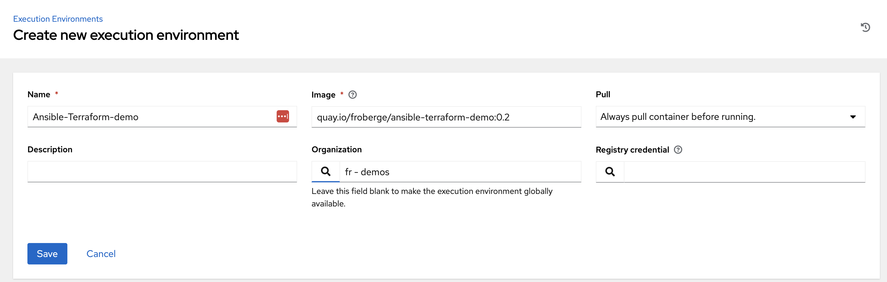
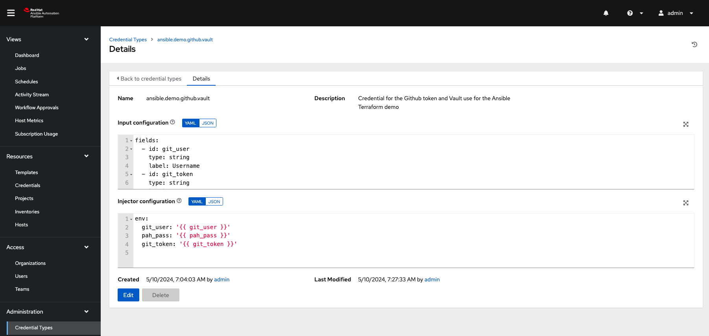
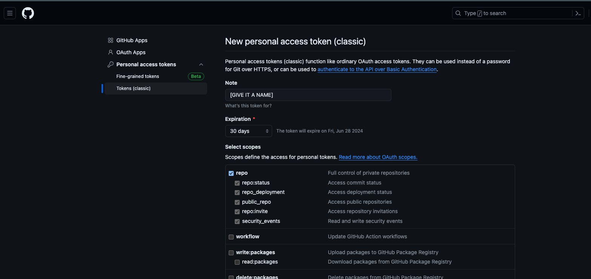
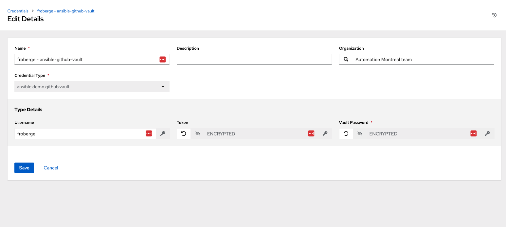
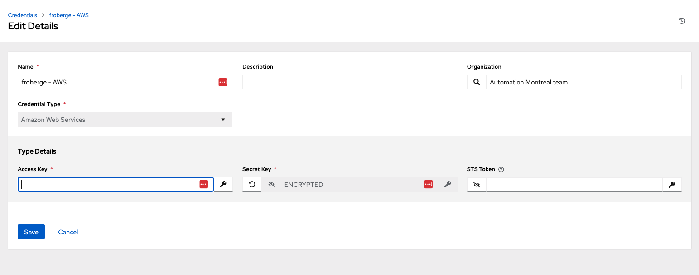
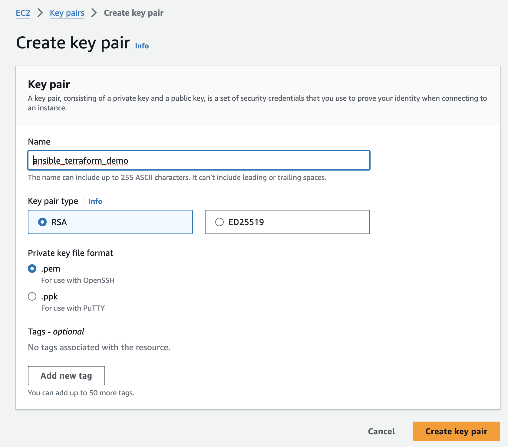
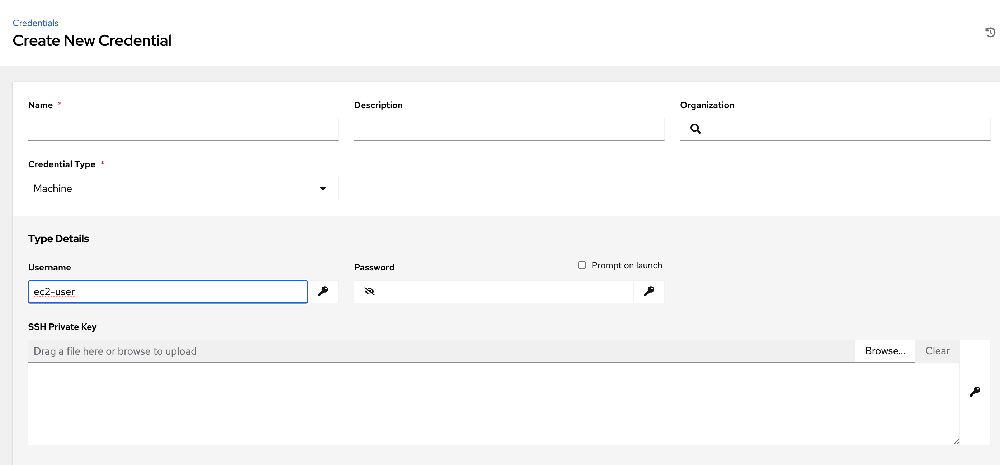
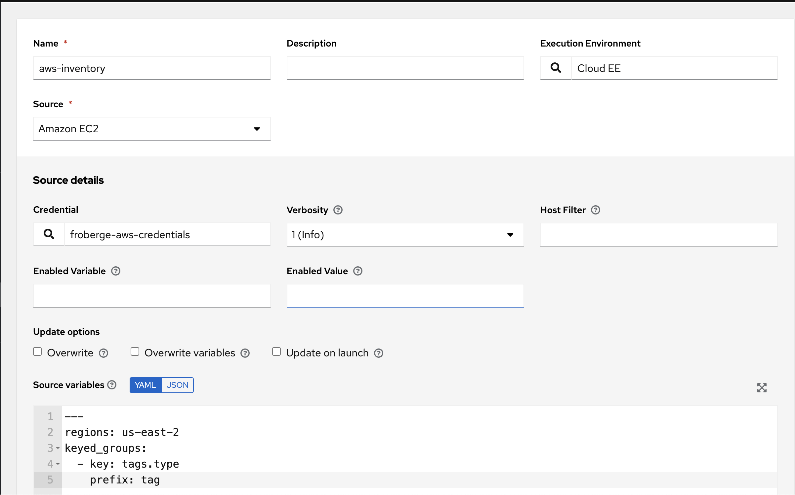
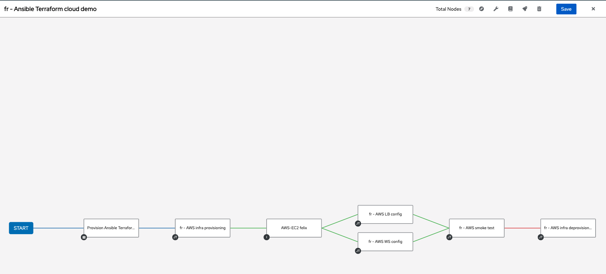

# AWS 

The AWS scenario is created using Terraform and Ansible.

:warning:  To get this working you need a fork of the [ansible terraform config repository](https://github.com/froberge/ansible_terraform_skeleton) or your own terraform code repository that deploy on AWS. IF you use your own, don't forget to adjust the code in possibly both repository.

## STEP

* Create the Execution environment and import it into AAP.

  * We need an execution environment in order to have the Terraform collection. You can find the info on how to [create and execution environment here](../exec-environment/README.md) You can also find an already compile version [here](https://quay.io/repository/froberge/ansible-terraform-demo).

  * In `Ansible Automation Platform`, add the newly created execution environment.
    *  In the platform under Execution environment click `Add`
    * Fill out the information.
    

* Create a new Crendital Type to contain Github Personal Access Token.
  *  In `Ansible Automation Platform` create e new Credential Types to contain you Github Personal Access token. as follow.
  
  You can use these values to populate the fields.
      ```script
      input configuration ( in yaml)

      fields:
        - id: git_user
          type: string
          label: Username
        - id: git_token
          type: string
          label: Token
          secret: true
        - id: pah_pass
          type: string
          label: Vault Password
          secret: true
      required:
        - username
        - password
        - pah_pass
      ```

      ```script
      Injector configuration ( in yaml )

      env:
        git_user: '{{ git_user }}'
        pah_pass: '{{ pah_pass }}'
        git_token: '{{ git_token }}'
      ```

  * In `GitHub`, ceate a `Personal Access tokens` on your account. You can create a token under your account _settinggs -> Developer Settings_ Great the token with the name you want, with the following credential, and the expiration date you desire.
  
  :warning: Copy the generated key, you will need in another step.

  * In `Ansible Automation Platform` Create the new Credential from the new type you just created with the `Personal Access tokens`
  


* Create a Credential which contains your AWS information.


* Ansible connects to EC2 instance using SSH. Let's start by creation a new [Key pair in AWS](https://docs.aws.amazon.com/servicecatalog/latest/adminguide/getstarted-keypair.html). 

  * Create key pair, call `ansible_terraform_demo` in your AWS account.
  
  :warning: if you change the name you need to edit the terraform main  file with the new name.

  * Create a credential of `type machine in AAP` which contains the SSH private key for the user `ec2-user`
  

* 1. Configure [AWS dynamic inventory](https://www.redhat.com/en/blog/configuring-an-aws-dynamic-inventory-with-automation-controller)

  * Define the different tags for the groups 
    


* Create the different templates needed in order to create the required workflow.


  * The following variable are needed in order for the [aws_infra_provisioning playbook](../aws_infra_provisioning.yml) to work.
  ```
    infra_state: [present / absent]
    force_init: true
    server_count: 
    prefix_instance_name: 
    instance_env: 
    project_name: 
    git_repo_url: ex: https://{{ git_user }}:{{ git_token }}@github.com/froberge/ansible_terraform_config.git
    git_work_dir: /tmp/terraform/aws
  ```

  * Needed variables for the other templates
  ```script
  ---
  infra_state: [present / absent]
  force_init: true
  git_repo_url: https://{{ git_user }}:{{ git_token }}@github.com/froberge/ansible_terraform_config.git
  git_work_dir: /tmp/terraform/aws
  lb_group_name: tag_dev_lb
  ws_group_name: tag_dev_web
  ```

  * Template that need to run in `Privilege Escalation`
    *  install_lb
    *  install_ws
