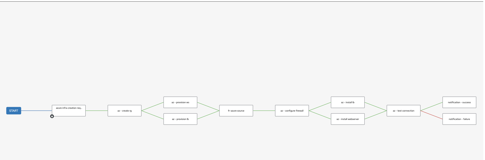

# Azure
The Azure scenario is created using only Ansible.



* Create a Credential which contains your Azure credentials
  * __Name:__ Choose a descriptive name for the credential.
  * __Subscription ID:__ Enter the subscription id where your resources created in Azure should be associated
  * __Client ID:__ Enter the appId value from the Service Principal creation.
  * __Client Secret:__ Enter the password from the Service Principal creation.
  * __Tenant ID:__ Enter the tenant from the Service Principal creation.


* Create the Execution environment and import it into AAP.

  * We need an execution environment in order to have the Azure collection. You can find the info on how to [create and execution environment here](../exec-environment/README.md). You can also find an already compile version [here](https://quay.io/repository/froberge/ansible_cloud_deploy).

* [Create an SSH Key](https://www.digitalocean.com/community/tutorials/how-to-create-ssh-keys-with-openssh-on-macos-or-linux). 

* Create a new Credential Type to contain the public key you've just created.
  ```
  This is the value that needs to be part of the env.
  env:
    AZURE_VM_SSH_PUBLIC_KEY: '{{ }}'
  ```
  

*  Create a new credential from the credential type you've just created. Use the public key previously created as a value.

:raising_hand: Add the new credential to the job that required the SSH key to be added.

* Create a `Machine` credential type with containing the private key. Using the right username/password and private key.


:raising_hand: Add the new credential to the job that required to connect by ssh to the vms.

* Configure [Azure dynamic inventory](https://www.redhat.com/en/blog/configuring-an-aws-dynamic-inventory-with-automation-controller).

  ``` script
  source varibles to get groups from Cloud Providers.

  ---
  keyed_groups:
    - prefix: tag
      key: tags
  ```

* Create the different job templates
  * Variable used in the different templates.
    * project_name: "ansible-demo"
    * res_group: "ansible-demo"
    * instance_name_list: ['webserver1', 'webserver2']
    * instance_name_list: [loadbalancer]
    * instance_env: "dev"
    * vm_type: "webserver"
    * vm_type: "lb"
    * lb_group_name: "tag_type_dev_lb"
    * ws_group_name: "tag_type_dev_webserver"
  

  * Template that need to run in `Privilege Escalation`
    *  install_lb
    *  install_ws

---