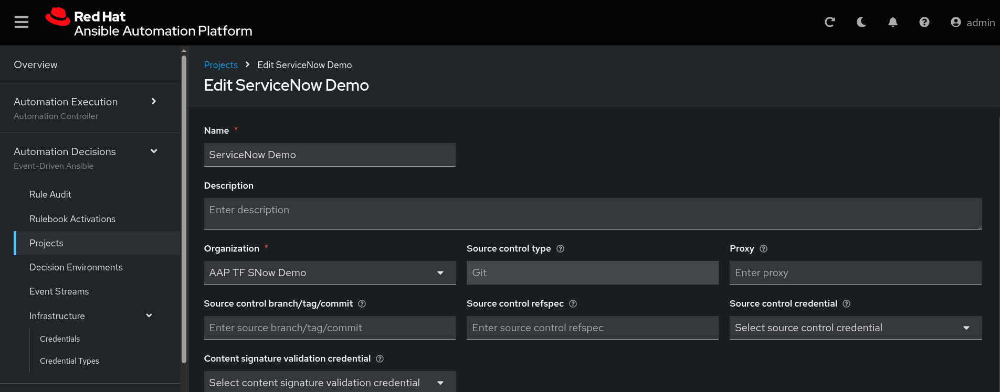
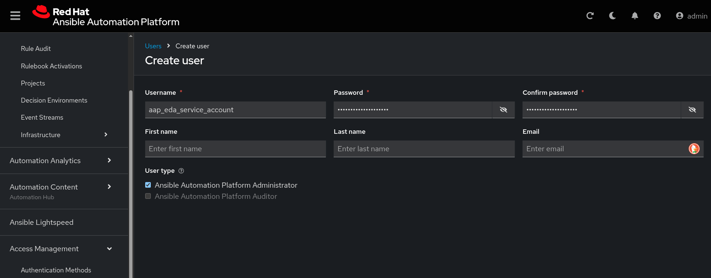
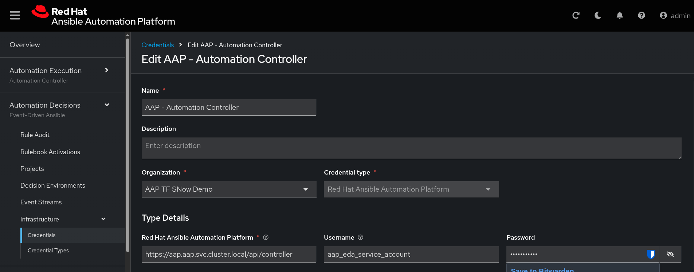

Create the AAP project pointing to the Git repo.


https://aap-aap.apps.ocp-mgmt.rh-lab.morey.tech/execution/projects/create
---

Create the empty cloud provider inventory

https://aap-aap.apps.ocp-mgmt.rh-lab.morey.tech/execution/infrastructure/inventories/inventory/create


---

Create the execution environment with TF in it.

https://aap-aap.apps.ocp-mgmt.rh-lab.morey.tech/execution/infrastructure/execution-environments/add

quay.io/froberge/ansible-terraform-demo:0.2


---

Create AWS access credential

Provision environment on demo.redhat.com
https://catalog.demo.redhat.com/catalog/babylon-catalog-prod/order/sandboxes-gpte.sandbox-open.prod

https://aap-aap.apps.ocp-mgmt.rh-lab.morey.tech/execution/infrastructure/credentials/create


---

Create AWS SSH cred

https://us-east-2.console.aws.amazon.com/ec2/home?region=us-east-2#CreateKeyPair:


---

Create AWS dynamic inventory

1. Create blank inventory
2. Open inventory, goto sources.
   1. Select Source `Amazon EC2`
   2. Set Execution Environment to `Default ...`
   3. Set Credential to `AWS` (created earlier)
   4. Set source variables
      
      ```yaml
      ---
      regions: us-east-2
      keyed_groups:
      - key: tags.type
      prefix: tag
      ```


---

EDA Setup

Create a project 


Create a user for EDA
- https://aap-aap.apps.ocp-mgmt.rh-lab.morey.tech/access/users/create



Create credential for EDA to connect to automation controller
- https://docs.redhat.com/en/documentation/red_hat_ansible_automation_platform/2.5/html/using_automation_decisions/eda-set-up-rhaap-credential-type



Create decision environment
- https://aap-aap.apps.ocp-mgmt.rh-lab.morey.tech/decisions/decision-environments/create

create rule book

added route for rulebook (activiation job) service

curl it
```
curl -H "Content-Type: application/json" -X POST https://servicenow-webhook-aap.apps.ocp-mgmt.rh-lab.morey.tech/ -d '{"description": "Your description here"}' --insecure
```
---

## ServiceNow Set Up

Business Rule - Trigger based on changes in tables
- https://xxxxxxx.service-now.com/now/nav/ui/classic/params/target/sys_script_list.do
- Create a table for the purpose of the demo
- The business rule calls the `RESTMessage` object


REST Message
- https://xxxxxxx.service-now.com/now/nav/ui/classic/params/target/sys_rest_message.do

https://xxxxxxx.service-now.com/x_rhtpp_nmorey_a_0_virtual_machine_requests.do?sys_id=-1&sysparm_view=Default%20view&sysparm_view_forced=true

https://ven05434.service-now.com/now/nav/ui/classic/params/target/sys_db_object.do%3Fsys_id%3Dea6f53afc3187a10b1876c0fb0013178%26sysparm_record_target%3Dsys_db_object%26sysparm_record_row%3D2%26sysparm_record_rows%3D2%26sysparm_record_list%3Dsys_scope%253D673a1caec3983610b1876c0fb001311a%255EORDERBYname

https://ven05434.service-now.com/x_rhtpp_nmorey_a_0_web_server_requests.do?sys_id=-1&sysparm_view=Default%20view&sysparm_view_forced=true

```
{
    "extra_vars": "{\"infra_state\": \"${infra_state}\", \"request_id\": \"${request_id}\",\"server_count\": \"${server_count}\",\"project_name\": \"${project_name}\"}"
}
```