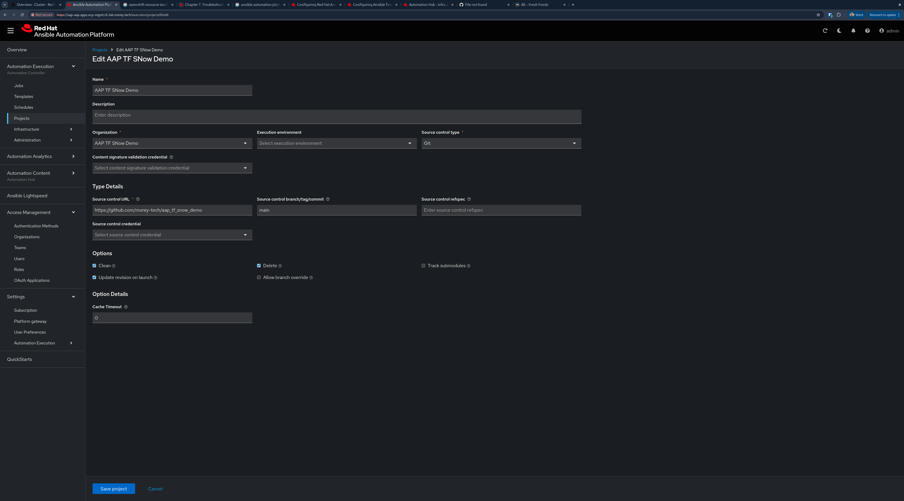
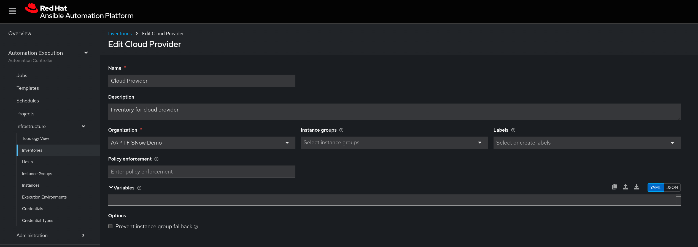
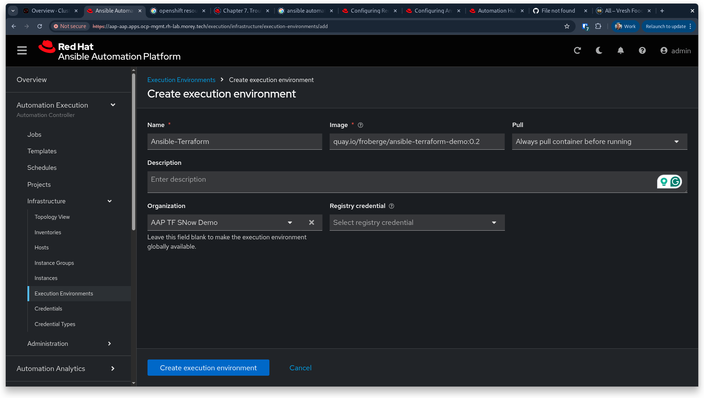
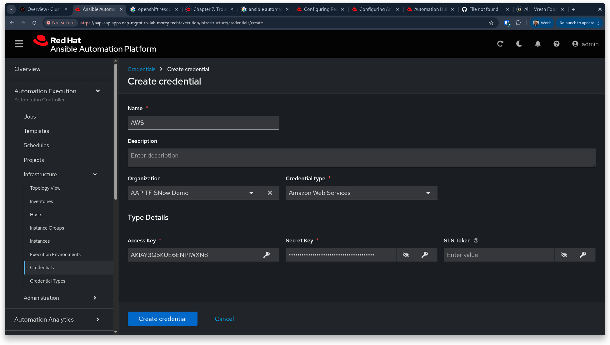
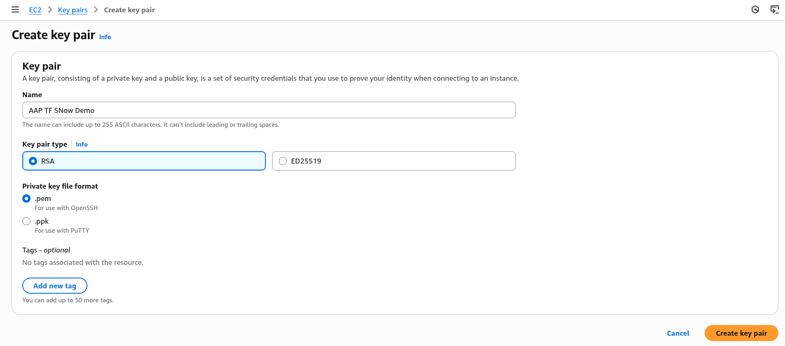
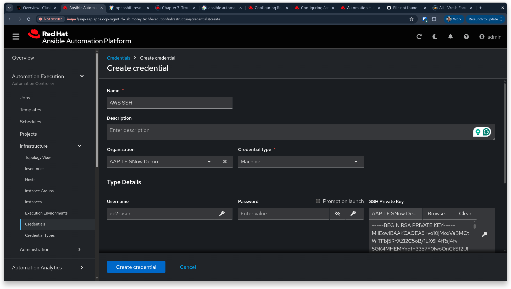
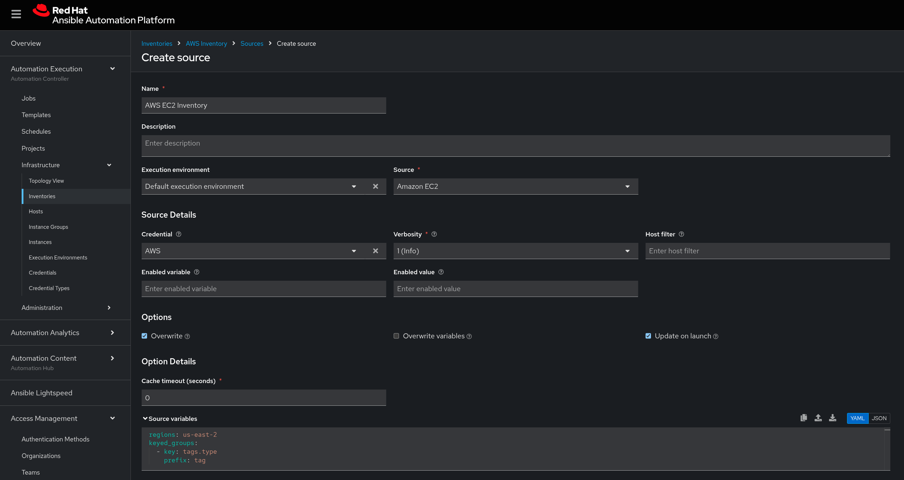

Create the AAP project pointing to the Git repo.



https://aap-aap.apps.ocp-mgmt.rh-lab.morey.tech/execution/projects/create
---

Create the empty cloud provider inventory

https://aap-aap.apps.ocp-mgmt.rh-lab.morey.tech/execution/infrastructure/inventories/inventory/create


---

Create the execution environment with TF in it.

https://aap-aap.apps.ocp-mgmt.rh-lab.morey.tech/execution/infrastructure/execution-environments/add

quay.io/froberge/ansible-terraform-demo:0.2


---

Create AWS access credential

Provision environment on demo.redhat.com
https://catalog.demo.redhat.com/catalog/babylon-catalog-prod/order/sandboxes-gpte.sandbox-open.prod

https://aap-aap.apps.ocp-mgmt.rh-lab.morey.tech/execution/infrastructure/credentials/create


---

Create AWS SSH cred

https://us-east-2.console.aws.amazon.com/ec2/home?region=us-east-2#CreateKeyPair:



---

Create AWS dynamic inventory

1. Create blank inventory
2. Open inventory, goto sources.
   1. Select Source `Amazon EC2`
   2. Set Execution Environment to `Default ...`
   3. Set Credential to `AWS` (created earlier)
   4. Set source variables
      
      ```yaml
      ---
      regions: us-east-2
      keyed_groups:
      - key: tags.type
      prefix: tag
      ```


---

