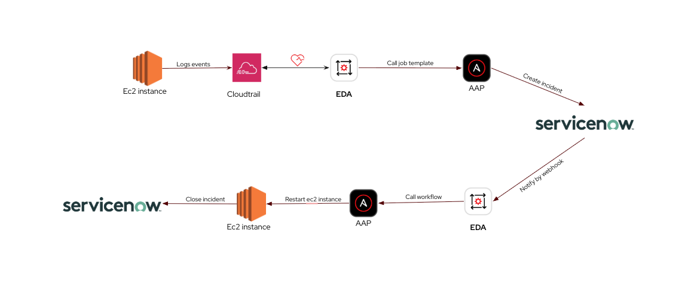
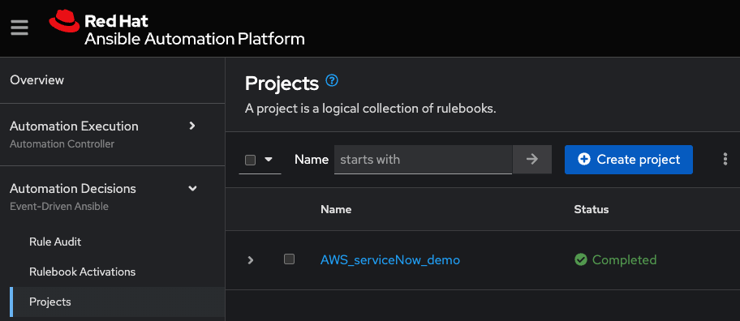
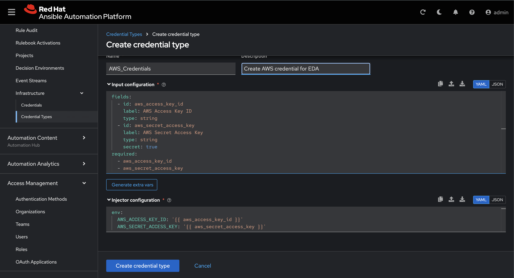
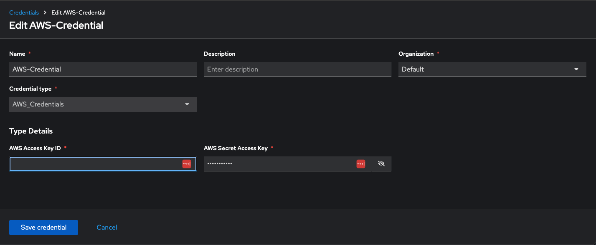
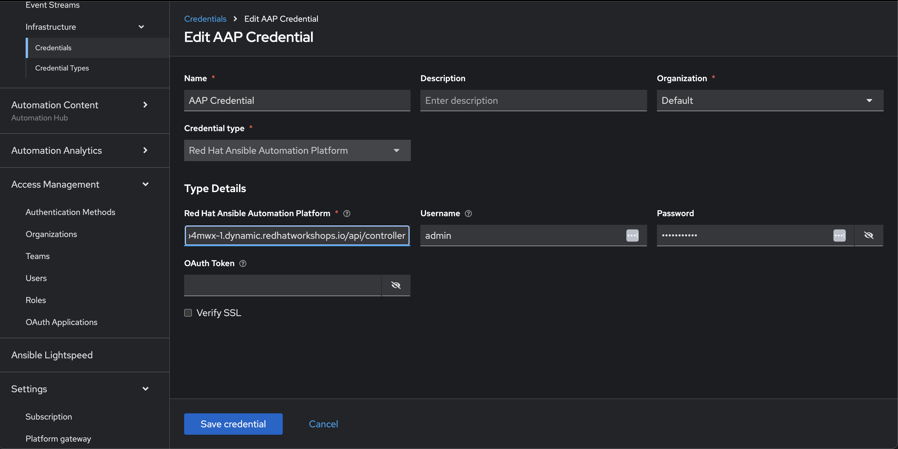
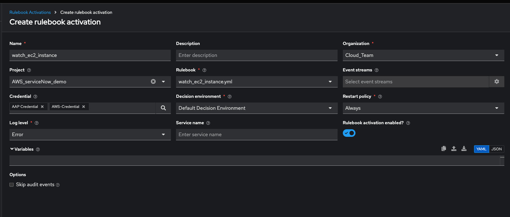
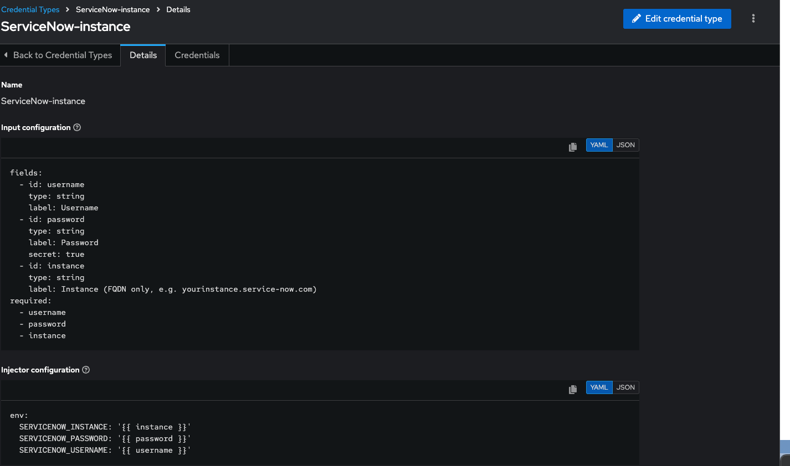
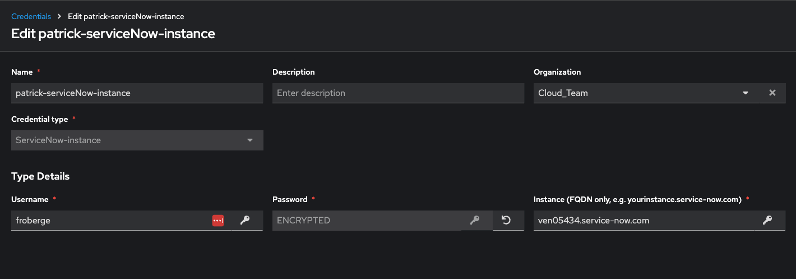
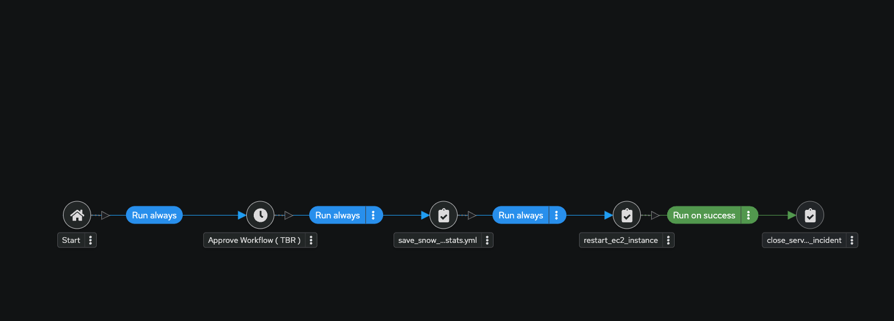
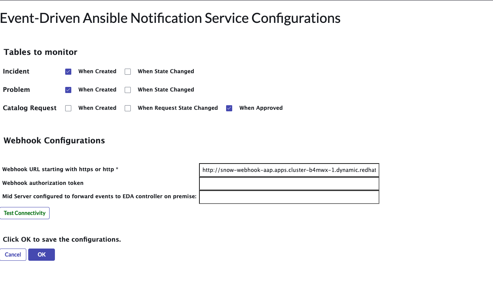

# 

#### Objective

The purpose of this project is to show how we can auto-remediate how AWS Cloud environment using [Event-Driven Ansible](https://www.redhat.com/en/technologies/management/ansible/event-driven-ansible).

---
#### Demo

In this demo we be integrating `Event-Driven Ansible` in 2 differents ways. This demo will create and auto healing scenario when an EC2 instance is shutdown. It will also integrate with ServiceNow to create and close an incident.


###### Prerequisite
1. Ansible Automation Platform 2.5 instance running. In this documentation I'll be using and instance running on OpenShift.
1. An AWS environment.
1. An Instance of ServiceNow running. We need to configure the EDA plugin.


__Implementation Diagram__


---
##### General Steps

###### Configure AWS
* Configure CloudTrail in order to monitor the events that are happening with the different EC2 instance for the selected region.
    * [youtube video](https://www.youtube.com/watch?v=CXbdsp9ThvM)
    * [queries](https://docs.aws.amazon.com/awscloudtrail/latest/userguide/lake-console-queries.html)

* Once you have cloudtrail configure, create some EC2 instance in AWS.  You can use the UI or you can run this [playbook](../playbooks/aws_infra_provisioning.yml)

###### Configure Event-Driven Ansible.

Now that you have your AWS environment up and running you need to configure your Ansible Automation Platform. 

:information_desk_person: Starting with Ansible Automation Platform 2.5 the different element have been integrated under a single UI. So Event-Driven Ansible can be found under the Automation Desisions section.

1. In order to create a Rulebook activations, we first need to create a project.


1. We will then need to create a new `credential type` to create hold the AWS credential.

    _input configuration_
    ```
    fields:
    - id: aws_access_key_id
        type: string
        label: AWS Access Key ID
    - id: aws_secret_access_key
        type: string
        label: AWS Secret Access Key
        secret: true
    required:
    - aws_access_key_id
    - aws_secret_access_key
    ```

    _injector configuration_
    ```
    extra_vars:
      aws_access_key_id: '{{aws_access_key_id}}'
      aws_secret_access_key: '{{aws_secret_access_key}}'
    ```
    

1. Once this is done, let's create the AWS Credential


1. We also need a credential to be able to call Red Hat Ansible Automation Platform from EDA. :warning: it uses the the url from the AAP platform, but you have to add `/api/controller` at the end. I use my admin username & password.


1. We can now activate the first rulebook. The first rulebook watched for the state of the EC2 instances.


1. Let's now activate the rulebook that will answer ServiceNow with the Webhook. This is done the same way as the previous one. 

    :raised_hands: Since AAP is running in an OpenShift Cluster. The pod for the rulebook needs to be expose with a service and a route. You can use these command in a cli.
    To find which the right pod.
    ```
    
    oc get pods -n aap        
    ```

    To create the service (use the pod found above)
    ```
     oc expose pod activation-job-XXXX --port=5001 --name=snow-webhook -n aap
    ```

    To expose the service
    ```
        oc expose svc snow-webhook -n aap
    ```

    To retrive the route to use with ServiceNow
    ```
        oc get route snow-webhook -n aap -o jsonpath='{.spec.host}'
    ```

    You can also test the integration with this curl command.
    ```
    curl -X POST [ROUTE] \
     -H "Content-Type: application/json" \
     -d '{"description": "EC2 i-1234567890 stopped"}'
    ```

###### Configure Ansible Automation Platform.

1. In order to be able to call ServiceNow we will have to create a ServiceNow credential Type.

_input configuration
```
fields:
  - id: username
    type: string
    label: Username
  - id: password
    type: string
    label: Password
    secret: true
  - id: instance
    type: string
    label: Instance (FQDN only, e.g. yourinstance.service-now.com)
required:
  - username
  - password
  - instance
```

_injector configuration_
```
env:
  SERVICENOW_INSTANCE: '{{ instance }}'
  SERVICENOW_PASSWORD: '{{ password }}'
  SERVICENOW_USERNAME: '{{ username }}'
```

1. Let's now create the credential.


1. We also need the credential to connect to the AWS account

1. Let's create a CloudProvider inventory

1. You now just need to import the required templates.

1. Finally you need to create a workflow for the ServiceNow remediation.


###### Configure ServiceNow

In ServiceNow, we need to configure the Notification Service for Event-Driven Ansible in the plugin. 


